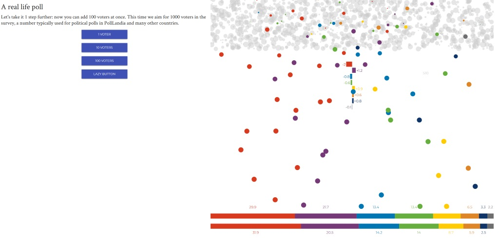

# Urval {#sampling}

Här hittar du:

- Slumpmässiga och icke-slumpmässiga urval

## Slumpmässigt urval i opinionsundersökningar

| Guide | Beskrivning |
| ----------------------- | ----------------------------------------------- |
| [Rock 'n Polls](http://rocknpoll.graphics/) | Se hur slumpmässigt urval påverkar resultatet av en opinionsundersökning. |

## Samplingdistribution

| Guide | Beskrivning |
| ----------------------- | ----------------------------------------------- |
| [Sampling Distribution](http://onlinestatbook.com/stat_sim/sampling_dist/index.html) | Visar effekten av centrala gränsvärdessatsen, och hur stickprovets medelvärde från en distribution av valfri form bildar en normalfördelning. |