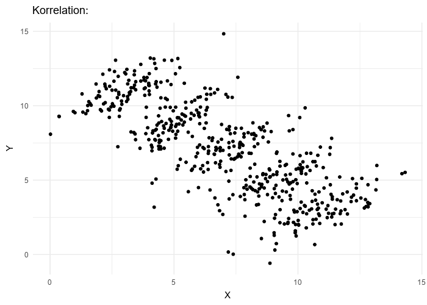

# Vilseledande statistik {#misleading-stats}

Här hittar du:

- Hur statistik kan användas vilseledande
- Tveksamma forskningspraktiker
- Råd för hur du undviker misstagen

## Undersöka andra än de man uttalar sig om {#inference-to-population}

Vill man prata om vad svenska medborgare över 18 år gör måste man också göra ett urval från dessa. Man kan inte gå till en gymnasieskola och leta upp 18-åringar att intervjua, och därefter uttala sig om svenska medborgare över 18 år. Då kan man endast uttala sig om de personer som man har intervjuat - inga andra.

Detta misstag finns i överflöd, och här följer ett axplock av exempel:

- I en enkät fick svenska bilister svara på en fråga.^[[Felaktiga slutsatser när SVD opinonsundersökte om dieselförbud](http://sverigesradio.se/sida/artikel.aspx?programid=2795&artikel=6865774) SR P1 Medierna 2018-01-19.] När resultatet presenterades framställdes det som om att det var alla svenskar som uttalat sig. Det är vilsledande eftersom man frågar en annan grupp människor än de man sedan uttalar sig om.
- I en undersökning fick kvinnliga opinionsbildare svara på frågor om hot.^[[Sju av tio kvinnliga opinionsbildare hotas
](https://www.svt.se/kultur/medier/kvinnliga-opinionsbildare-utsatta-for-hot-och-trakasserier) SVT 2017-04-18, se också [undersökningen från SIFO](http://tu.se/wp-content/uploads/2017/04/PDF-Hot-mot-kvinnliga-opinionsbildare.pdf#page=2) 2017-03-24 med projektnummer 1536739.] När resultatet presenterades framställdes det som att kvinnor var extra utsatta. Det är vilsledande eftersom män inte ens deltog i undersökningen och någon jämförelse mellan män och kvinnor därför inte kunde göras.
- I en rapport fick Facebookanvändare svara på frågor om polisen i sociala medier.^[[Utvärderinga av Polisens närvaro i sociala medier (RPS Rapport 2013)](https://polisen.se/Global/www%20och%20Intrapolis/Utvärderingar/2013%20utvärderingsrapporter/Utvardering_Polisens_narvaro_i_sociala_medier.pdf).] Respondenterna kallades sedan genomgående "allmänheten". Det är vilsledande dels eftersom allmänheten är ett vagt och oprecist begrepp, dels för att det är oklart vilka det egentligen är som svarat med tanke på att vem som helst fick svara.

Vill man uttala sig om de som har svarat i en enkät eller undersökning kallar man de lämpligen för *respondenter* eller *svarspersoner*.

Läs mer:

- [Lathund för journalister](#journalist)

## Cirkelresonemang {#assumptions-circularity}

Om man lägger antagandet i slutsatsen är det extremt vilseledande eftersom man inte kommer med någon ny information än den man redan hade antagit från början. Det är ett klassiskt fall av cirkelbevisning, fast dolt som en statistisk analys.

The Guardian [analysade 70 miljoner kommentarer](https://www.theguardian.com/technology/2016/apr/12/the-dark-side-of-guardian-comments) de hade fått till sina nyhetsartiklar. De kom fram till att majoriteten av de kommentarer som redaktörerna tagit bort bestod av hot och glåpord mot journalisterna.

Men vid närmare granskning är denna slutsats inte ett resultat av den statistiska analysen. Det var ett *antagande* de gjorde eftersom de inte klassificerade kommentarerna över huvud taget. I [metodbeskrivningen](https://www.theguardian.com/technology/2016/apr/12/how-we-analysed-70m-comments-guardian-website) står det "we took blocked comments as an indicator of abuse and/or disruption". Med andra ord, de kommentarer som tagits bort från The Guardian antogs vara hot eller glåpord mot journalisterna. Det var alltså inget de undersökte.

Detta är vilseledande eftersom The Guardian ger intrycket av att de mycket exakt klassificerat hur många av deras kommentarer som var hot och glåpord mot journalisterna. Men detta antagande blev i stället deras slutsats, och det är ett cirkelbevis.

Läs mer:

- [Uppmaning till journalister att sansa er förtjusning för big data](http://www.backendmedia.se/2016/04/24/journalister-big-data/)
- <https://en.wikipedia.org/wiki/Circular_reasoning>

## Förväxla korrelation och kausalitet

## Confounding

- <https://en.wikipedia.org/wiki/Confounding>

## Regression mot medelvärdet

- <https://en.wikipedia.org/wiki/Regression_toward_the_mean>

## Selection bias, cherry picking {#cherry-picking}

Detta är förmodligen det absolut vanligaste sättet att vilseleda. Om det görs 100 studier inom ett område så kommer resultaten att spreta åt olika håll. Då kan man enkelt vilseleda genom att:

- välja ut den studie som stödjer den slutsats man vill föra fram
- välja ut studier från *båda* sidor och sedan säga att forskningen inte kan bestämma sig

![Bilden visar den relativa risken att få cancer och varje punkt är en enskild studie. Punkterna till vänster visar studier med minskad cancerrisk och punkterna till höger visar studier med ökad cancerrisk [@schoenfeld_is_2012].](images/cancer-relativ-risk.png)

Genom att debattera en studie i taget kan man få intrycket av att forskningen svänger fram och tillbaka för varje ny studie. Men då tar man inte hänsyn till skillnader mellan studierna. För att bedöma skillnader mellan studier behöver man därför kunskap om hur forskning går till.

Läs mer:

- [Missförstånd: "Om två studier visar olika resultat ligger sanningen någonstans mittemellan"](#inbetween)
- <https://en.wikipedia.org/wiki/Selection_bias>
- <https://en.wikipedia.org/wiki/Cherry_picking>
- <https://en.wikipedia.org/wiki/Collider_(epidemiology)>
- Endogenous Selection Bias: The Problem of Conditioning on a Collider Variable [@elwert_endogenous_2014].

## Concept creep

Se Haslam 2016.

## Relativa och absoluta förändringar

- <https://en.wikipedia.org/wiki/Relative_change_and_difference>

## Texas sharpshooter fallacy

- <https://en.wikipedia.org/wiki/Texas_sharpshooter_fallacy>

## Goodharts law

- <https://en.wikipedia.org/wiki/Goodhart%27s_law>

## Förväxla betingade sannolikheter {#transposed-conditional}

Att förväxla betingade sannolikheter är något som vi ofta tenderar att göra, men dessvärre inte alltid upptäcker.

Sannolikheten att en händelse B inträffar, givet att händelsen A redan har inträffat, kallas betingad sannolikhet. Det skrivs P(B|A). Det är viktigt att man inte förväxlar detta med sannolikheten att händelse A inträffar, givet att händelsen B redan har inträffat. Det skrivs omvänt, alltså P(A|B).

Det är exempelvis uppenbart att en person som har hängts oftast dör, men det är inte uppenbart att en person som är död har hängts. Figuren nedan kan illustrera detta, samt ett klassiskt citat:

> Vad är sannolikheten för att få en död person (D) med tanke på att personen hängdes (H), det vill säga i symbolform, vad är P(D|H)? Det är uppenbart att det blir mycket högt, kanske 0,97 eller högre. Låt oss nu vända på frågan: Vad är sannolikheten för att en person har hängts (H) med tanke på att personen är död (D), det vill säga vad är P(H|D)? Den här gången kommer sannolikheten utan tvivel att vara mycket låg, kanske 0,01 eller lägre. Ingen skulle sannolikt göra misstaget att ersätta den första uppskattningen (0,97) för den andra (0,01), det vill säga att acceptera 0,97 som sannolikheten för att personen har hängts med tanke på att personen är död. [@carver_case_1978]

<!-- Idén till Venndiagrammen kommer från Lambdin (2012) "Significance tests as sorcery: Science is empirical—significance tests are not". Han har dock exempel med mardröm/misshandel. -->

```{r venn-diagram-inverse-probability-a, fig.cap="Sannolikheten att man är död givet att man har blivit hängd, P(D|H), är förmodligen väldigt hög.", fig.width=3, fig.height=3}
library(VennDiagram)
grid.newpage();
venn.plot <- draw.pairwise.venn(
  area1 = 100,
  area2 = 20,
  cross.area = 19,
  cex = 0,
  ext.text = FALSE,
  #cat.prompts = FALSE,
  #ind = FALSE,
  category = c("Hängd", "Död"),
  #fill = c("blue", "red"),
  cat.default.pos = "text",
  #fontfamily = "Arial",
  cat.pos = c(2, 12),
  cat.cex = c(1.3, 1.2),
  euler.d = TRUE,
  scaled = TRUE,
  sep.dist = 2,
  rotation.degree = -20,
  cat.just = list(c(0.5, 1), c(1.2, -0.3)),
)
```

```{r venn-diagram-inverse-probability-b, fig.cap="Sannolikheten att man är hängd givet att man är död, P(H|D), är förmodligen låg.", fig.width=3, fig.height=3}
library(VennDiagram)
grid.newpage();
venn.plot <- draw.pairwise.venn(
  area1 = 100,
  area2 = 20,
  cross.area = 2,
  cex = 0,
  ext.text = FALSE,
  #cat.prompts = FALSE,
  #ind = FALSE,
  category = c("Död", "Hängd"),
  #fill = c("blue", "red"),
  cat.dist = 0,
  cat.default.pos = "text",
  #fontfamily = "Arial",
  cat.pos = c(2, 12),
  cat.cex = c(1.3, 1.2),
  euler.d = TRUE,
  scaled = TRUE,
  sep.dist = .2,
  rotation.degree = -20,
)
```

Dessa två sannolikheter är logiskt sett helt olika saker som inte nödvändigtvis har något med varandra att göra, men de förväxlas tyvärr regelbundet.

Här är några exempel när betingade sannolikheter har förväxlats:

- **Socialstyrelsen**. Socialstyrelsen förväxlade betingade sannolikheter när de skulle bedöma asylsökares ålder genom att undersöka deras knän. De räknade ut andelen barn som har moget knä, alltså P(barn|moget knä). Men de uttalade sig därefter om andelen med moget knä som är barn, P(moget knä|barn). Läs [Professorer: ”Stort misstag – de har räknat fel”](https://www.svd.se/professorer-om-siffror-bakom-alderstester-de-har-raknat-fel) eller se videon [Socialstyrelsen, statistik och åldersbedömningen av Johan Bring](https://www.youtube.com/watch?v=jmtnnzodaR8). 
- **Sexualbrott**. Nästan alla som misstänks för våldtäkt är män.^[98 procent av misstänkta våldtäktsmän år 2016 var män, enligt [BRÅ](https://bra.se/statistik/statistik-utifran-brottstyper/valdtakt-och-sexualbrott.html).] Denna fakta används ibland som argument för att man måste akta sig för alla män då man inte vet vilken man som kommer att begå en våldtäkt. Sannolikheten att gärningsmannen är en man om en våldtäkt sker, alltså P(man|våldtäkt), är väldigt hög. Men det är inte samma sak som att om man möter en man så kommer man att bli våldtagen, P(våldtäkt|man).
- **Signifikanstest**. P-värdet visar sannolikheten att erhålla datan givet att nollhypotesen är sann, alltså P(data|nollhypotes). Men en vanlig missuppfattning är att man får reda på sannolikheten för nollhypotesen, P(nollhypotes|data). Även Carver skriver om detta: "Även om detta verkar vara ett osannolikt misstag är det precis den sorts misstag som görs med tolkningen av statistisk signifikanstestning -- uppskattningar av P(H|D) tolkas som om de var uppskattningar av P(D|H), när de uppenbart inte är desamma" [@carver_case_1978].

Att förväxla betingade sannolikheter kallas också *fallacy of the transposed conditional*, *confusion of the inverse*, *conditional probability fallacy* eller bara *inverse fallacy*. 

### Se även

- <https://en.wikipedia.org/wiki/Confusion_of_the_inverse>
- <https://en.wikipedia.org/wiki/Prosecutor%27s_fallacy>
- <https://www.matteboken.se/lektioner/mattespecialisering/sannolikhetsteori/betingad-sannolikhet>

## Upprepade statistiska tester (p-hacking) {#p-hacking}

Ju fler statistiska tester man gör, desto lättare är det att hitta samband som inte finns (falska alarm).

Faktum är att det är så enkelt att begå fel att man är *garanterad* att hitta åtminstone ett (1) samband som inte finns om man gör ett 60-tal statistiska tester. Och det är inte ovanligt att man gör många statistiska tester för att se vad man kan hitta.

Figuren nedan visar sannolikheten att hitta samband som inte finns. Om man gör 15 statistiska tester så är det alltså över 50 % sannolikhet att hitta ett samband som egentligen inte finns. Då kan man lika väl singla slant.  Med andra ord, ju mer frihet man har i sin dataanalys, desto lättare är det att råka ut för falska alarm.

```{r type-one-error, echo=FALSE, warning=FALSE}
N <- 100
type1error <- list(N)
for(numtests in 1:N)
{
  type1error[numtests] <- (1 - (0.95 ^ numtests)) * 100
}
plot(1:N, type1error, type="line", main="Sannolikhet att hitta samband som inte finns", xlab="Antal statistiska tester", ylab="Sannolikhet (%)")
```

Det som händer, rent statistiskt, är att man kommer att hitta ett lågt p-värde 5 % av gångerna.

Hur ska man göra för att undvika problemet med multipla jämförelser? Det finns flera förslag:

- Rapportera alla tester du gör. Men då måste man komma ihåg att skriva ned det, vilket inte alltid är det lättaste.
- Korrigera p-värdena. Det kan man göra med *Holm/Bonferroni-metoden*. Men då måste man också komma ihåg hur många tester man faktiskt har gjort.
- Skilj på hypotesgenererande undersökningar och hypotestestande undersökningar. När man genererar hypoteser får man utforska som man vill. När man testar hypoteser så måste man vara mer strikt. Det viktiga är att man är ärlig och skriver vad man har gjort.
- Gör om studien en gång till, fast med ny data.
- Använd så kallad *random cross-validation*. Det innebär att man endast analyserar 70 % av datan. Därefter kontrollerar man att de samband man hittat också hittas på resterande 30 % av datan.

Kallas också *garden of forking paths*, *multiple comparison problem* eller *p-hacking*. Läs mer:

- <https://en.wikipedia.org/wiki/Multiple_comparisons_problem>
- <https://en.wikipedia.org/wiki/Data_dredging>
- <https://en.wikipedia.org/wiki/Prosecutor%27s_fallacy>
- <https://en.wikipedia.org/wiki/False_positive_paradox>
- [This cartoon explains why predicting a mass shooting is impossible](https://www.vox.com/2016/6/15/11934794/cartoon-predicting-a-mass-shooting-mathematically-impossible)

## Efterhandsförklaringar {#harking}

Efterhandsförklaringar innebär att man försöker förklara något efter att det hänt. Förklaringar är en viktigt del i vetenskapligt arbete och ligger till grund för (nya) teorier och förutsägelser. Men det kan uppstå problem om man inte berättar att man har gjort en förklaring i efterhand utan i stället ger sken av att man har förutsett en händelse eller testat en teori.

Efterhandsförklaringar kan med fördel användas för att skapa nya förutsägelser som sedan kan testas i en ny situation. Om man däremot inte medger att det är en efterhandsförklaring, utan i stället ger sken av att det är en hypotes som testats, uppstår ett cirkelbevis. Det kan exempelvis ske genom att man skriver hypoteser efter (snarare än före) man analyserar datan. Enligt filosofen Deborah Mayo har man inga som helst belägg för ett påstående om ingenting har gjorts för att visa på vilka sätt påståendet kan vara falskt [@mayo_statistical_2018, 5].^[Hon kallar det *BENT* - bad evidence, no test.] Om man skriver en hypotes så att den passar datan har alltså inget hypotestest över huvud taget ägt rum.

Enligt en uppskattning av är det ungefär hälften av forskare som skriver hypoteser efter de analyserat datan, vilket är en anledning till att forskning ofta inte går att återupprepa av oberoende forskare. <!-- XXX Ange källa -->

Efterhandsförklaringar kallas även *HARKing* (hypothesizing after the results are known), *post hoc-förklaringar*, *ex post facto-förklaringar*, eller *post hoc, ergo propter hoc* (latin för "efter detta, därför på grund av detta"). Dessa ska dock inte förväxlas med [post hoc-analys](https://en.wikipedia.org/wiki/Post_hoc_analysis).

### Se även

- <https://en.wikipedia.org/wiki/Testing_hypotheses_suggested_by_the_data>
- <https://sv.wikipedia.org/wiki/Post_hoc_ergo_propter_hoc>

## Låg power

- <https://en.wikipedia.org/wiki/Statistical_power>

## Publication bias

- <https://en.wikipedia.org/wiki/Publication_bias>

## Felaktig generalisering

- <https://en.wikipedia.org/wiki/Faulty_generalization>
- <https://en.wikipedia.org/wiki/Overwhelming_exception>
- <https://en.wikipedia.org/wiki/Generalization>
- <https://plato.stanford.edu/entries/generics/> - Generic Generalizations

## "Statistiskt säkerställd"

Ett vanligt uttryck i massmedierna, och i viss mån vetenskapliga rapporter, är uttrycket att resultatet är *statistiskt säkerställt*. Ofta betyder det samma sak som statistiskt signifikant.

Men det är bättre att använda uttrycket "statistiskt signifikant" i stället, av två skäl:

1. Statistik handlar om hur man hanterar *osäkerhet*, och utgångspunkten är att all inferentiell statistik är osäker (eftersom den bygger på induktiv logik). Därför är det missvisande att säga att man nått en slags säkerhet. Vad man gör är att minimera osäkerheten, men osäkerhet kan aldrig elimineras med induktiv logik.

2. Statistisk signifikans handlar om sannolikheten att få ett resultat (eller mer extremt resultat), givet ett antagande om en nollhypotes. Det innebär att det går att manipulera fram ett statistiskt signifikant resultat genom att [göra många statistiska tester](#p-hacking), vilket *minskar* sannolikheten att resultaten är sanna men *ökar* sannolikheten att få statistiskt signifikant resultat. Men trots att statistisk signifikans handlar om sannolikheten att erhålla resultatet, förväxlas det ofta som styrkan på bevisningen. Det är dock två olika saker [@dienes_understanding_2008, 122; @royall_statistical_1997]. Att kalla resultatet statistiskt säkerställt under sådana omständigheter är därför gravt missvisande.

## Base rate fallacy

- <https://en.wikipedia.org/wiki/Base_rate_fallacy>

## Ecological fallacy

Den ekologiska fallasin (en variant av *divisionsfelslutet*) innebär att man analyserar data på gruppnivå och sedan felaktigt drar slutsatser om enskilda individer som tillhör den gruppen.

Fallasin uppstår därför att man förväxlar analysnivåer. Om man analyserar skillnader mellan kön, länder eller företag så gäller också slutsatserna skillnader mellan gruppen män respektive kvinnor, mellan länder samt mellan företag. Slutsatsen gäller *inte* inte de enskilda personerna, de enskilda länderna eller de enskilda företagen.

Det finns fyra olika typer av ekologiska fallasier, och en av dem är [Simpsons paradox](#simpsons-paradox) so beskrivs närmre nedan.

- <https://en.wikipedia.org/wiki/Ecological_fallacy>

## Simpsons paradox {#simpsons-paradox}

Låt säga att universitetet ska anställa nya forskare. De anställer 54 % av männen som söker, men bara 46 % av kvinnorna som söker. Alla sökande är dock lika kvalificerade. Är det belägg för könsdiskriminering?

Du kanske svarar ja, siffrorna visar tydligt att män anställs i högre utsträckning än kvinnor. Men låt oss gräva djupare.

|           |  Män   |  Kvinnor  |
|-----------|:------:|:---------:|
|Historia   | 1 / 5  |   2 / 8   |
|Geografi   | 6 / 8  |   4 / 5   |
|Universitet| 7 / 13 |   6 / 13  |

Läs tabellen ovan som att 1 man har anställts till historia av totalt 5 manliga sökanden. Likaså har 2 kvinnor anställts av totalt 8 kvinnliga sökanden, och så vidare.

Totalt har alltså 7 manliga av totalt 13 manliga sökanden anställts på universitet som helhet (54 %), och 6 kvinnliga av totalt 13 kvinnliga sökanden (46 %). För enkelhetens skull kan vi göra om tabellen ovan till tabellen nedan med procent i stället.

|           |  Män   |  Kvinnor  |
|-----------|:------:|:---------:|
|Historia   | 20 %   |   25 %    |
|Geografi   | 75 %   |   80 %    |
|Universitet| 54 %   |   46 %    |

Med andra ord kan vi se att en högre andel kvinnor har anställts i både historia och geografi, men det är ändå en högre andel män som anställts på universitet som helhet. Om både historia och geografi anställer fler kvinnor än män, hur kan det ändå vara fler män än kvinnor som anställs totalt?

Det finns flera förklaringar vi kan avfärda direkt:

- Det beror inte på att fler män eller kvinnor har sökt. Det är lika många sökanden totalt (13 kvinnor och 13 män).
- Det beror inte på att detta exempel handlar om få personer (26 stycken). Om vi multiplicerar alla siffror med tusen förblir resultatet detsamma.

Vad som däremot kan förklara denna paradox är att *fler kvinnor sökte tjänster som är svårare att få*.

Historia anställde 3 av 13 sökanden, medan geografi anställde 10 av 13 sökanden. Det är med andra ord lättare att komma in på geografi, som också hade fler manliga sökanden.

Vi får därför olika resultat beroende på om vi väljer att analysera datan på aggregerad nivå (universitetet som helhet) jämfört med om vi väljer att analysera varje institution (historia eller geografi) för sig.

Det är detta som kallas Simpsons paradox. Det är *hierarkin* i datan som påverkar slutsatsen, och slutsatsen påverkas av vilken nivå i denna hierarki man väljer att analysera. I det här fallet har hierarkin två nivåer: institutioner respektive universitet. Ett annat exempel på en hierarki med fyra nivåer: elever inom klasser inom en skola inom en kommun. 

```{r}
if(knitr::is_html_output()) {
	# Animation for HTML.
	""
}
if(knitr::is_latex_output()) {
	# Static image for PDF.
	"PDF-bild"
}
```

Vad ska du göra för att undvika Simpsons paradox? 

1. Kontrollera om din data innehåller hierarkier eller grupper av något slag.
2. Kontrollera om hierarkierna eller grupperna har analyserats var för sig eller tillsammans.
3. Kontrollera om du får olika resultat när du analyserar varje grupp för sig, jämfört med om du analyserar alla grupper tillsammans.

- [Interaktiv visualisering av Simpsons paradox](http://vudlab.com/simpsons/)
- <https://en.wikipedia.org/wiki/Simpson%27s_paradox>
- <https://plato.stanford.edu/entries/paradox-simpson/>

## Berksons paradox {#berksons-paradox}

Videoklippet [Does Hollywood ruin books? - Numberphile](https://www.youtube.com/watch?v=FUD8h9JpEVQ) beskriver Berksons paradox som även :

<iframe src="https://www.youtube.com/embed/FUD8h9JpEVQ?rel=0" frameborder="0" class="mediaplayer videoplayer" allowfullscreen></iframe>

- <https://en.wikipedia.org/wiki/Berkson%27s_paradox>
- Berkson (2014) [Limitations of the Application of Fourfold Table Analysis to Hospital Data](https://doi.org/10.1093/ije/dyu022)

## Se även

- [Missförstånd om statistik](#misconceptions-stats)
- [Checklista för statistika undersökningar](#checklist)
- Statistiska metoder för att upptäcka inkonsistenser i data
	- GRIM Test [@brown_grim_2016]
	- GRIMMER test [@anaya_grimmer_2016]
	- [Introducing SPRITE (and the Case of the Carthorse Child)](https://hackernoon.com/introducing-sprite-and-the-case-of-the-carthorse-child-58683c2bfeb)