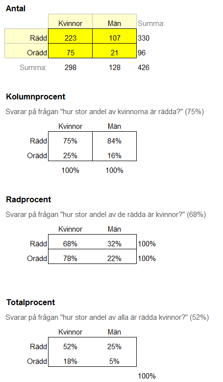
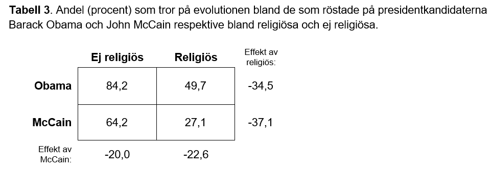

# (PART) Kommunicera {-}

# Tabeller {#tables}

Här hittar du:

- Hur du bör utforma korstabeller
- Skillnaden mellan kolumnprocent, radprocent och totalprocent

## Tabellens delar

En tabell i en vetenskaplig publikation består ofta av tre delar: 

- tabellhuvud
- tabellresultat
- tabellkommentar

")

### Tabellhuvud

Tabellhuvudet inleds med tabellens nummer (Tabell 1, Tabell 2, Tabell 3 etc.) för att kunna hänvisa till tabellen i den löpande texten. Det gör det enkelt för läsaren att hitta rätt tabell.

Efter tabellnumret kommer en kort rubrik. Den bör vara slagkraftig och koncis men också redovisa tidsperiod, analysenheter och enheten (exempelvis procent). Om du redovisar resultatet av en frågeundersökning kan själva frågan också skrivas i rubriken om den är tillräckligt kort. 

### Tabellresultat

Tabellens resultat innehåller den viktigaste informationen. Du bör inte använda decimaler, utan avrunda helst om möjligt. Om du redovisar procent så avrunda också summan till 100 procent. Då ser man om procenten summeras på raden (som på bilden ovan) eller i kolumnen.

- Om du jämför två tidsperioder kan det vara bra att framhäva skillnaderna i en egen kolumn.
- Om du jämför två grupper med varandra (exempelvis män respektive kvinnor) kan det vara bra att använda en kolumn för samtliga tillsammans (totalt).
- Om tabellen blir stor och svår att överblicka kan du lösa det på två sätt: (1) Markera det viktigaste genom fetmarkering eller inringning. (2) Slå ihop kategorier så att de blir färre.

### Tabellkommentar

I tabellkommentaren skriver du mer utförlig information i lite mindre textstorlek om exempelvis:

- Hur variabler har slagits ihop eller skapats.
- Källa till datamaterialet.
- Hur tabellen ska tolkas.
- Frågeformulering vid opinionsundersökning.
- Vad kategorin "Övrigt" innehåller.

Glöm inte att skriva antalet analysenheter (såsom n=1 585) eller "antal svar", "antal svaranden" eller "antal respondenter".

## Procent i korstabeller {#crosstabs-percent}

En korstabell (*contingency table* eller *cross tab*) innehåller 2-4 variabler. När man gör en korstabell är det viktigt att den summeras (med procent) på rätt sätt för att svara på rätt frågeställning. Anledningen till att vi använder procent, snarare än det "råa" antalet, är för att procent är standardiserad och kan jämföras. Vi kan då exempelvis jämföra *andelen* kvinnor och män snarare än antalet kvinnor och män. Då gör det ingenting att den ena gruppen är större än den andra.

Tabellen nedan är en korstabell med två variabler (kön och rädd) som båda har två variabelvärden (kvinnor/män respektive rädd/orädd). Här ser vi alltså att det finns 426 personer, varav 298 är kvinnor och 128 är män. Samtidigt är 330 personer rädda medan 96 personer är orädda. Vi ska nu summera tabellen med tre typer av procent: kolumnprocent, radprocent och totalprocent.

| | Kvinnor | Män | Totalt
| --------- | :---------: | :---------: | :---------:
| Rädd | 223 | 107 | 330
| Orädd | 75 | 21 | 96
| Totalt | 298 | 128 | 426

Table: Antalet personer.

### Kolumnprocent

En tabell med kolumnprocent måste läsas kolumnvis. Kolumnprocent svarar på frågan "hur stor andel av *kvinnorna* är rädda?". Svar: 75%. Man ser om en tabell har kolumnprocent om man kan addera alla procenttal i kolumnen så att de blir 100 (75 + 25 = 100 respektive 84 + 16 = 100). Kolumnprocent gör att vi kan jämföra kvinnor med män (för att se vilka som är mest rädda).

| | Kvinnor | Män
| --------- | :---------: | :---------:
| Rädd | **75** | 84
| Orädd | **25** | 16
| Totalt | **100 (n = 298)** | 100 (n = 128)

Table: Kolumnprocent.

### Radprocent

En tabell med radprocent måste läsas radvis. Radprocent svarar på frågan "hur stor andel av *de rädda* är kvinnor?". Svar: 68%. Man ser om en tabell har radprocent om man kan addera alla procenttal på raden så att de blir 100 (68 + 32 = 100 respektive 78 + 22 = 100). Radprocent gör att vi kan jämföra rädda med orädda (för att se om de är kvinnor eller män).

| | Kvinnor | Män | Totalt
| --------- | :---------: | :---------: | :---------:
| Rädd | **68** | **32** | **100 (n = 330)**
| Orädd | 78 | 22 | 100 (n = 96)

Table: Radprocent.

### Totalprocent

En tabell med totalprocent måste läsas cellvis. Totalprocent svarar på frågan "hur stor andel av *alla* är rädda kvinnor?". Svar: 52%. Man ser om en tabell har totalprocent om man kan addera alla procenttal så att de blir 100 (52 + 18 + 25 + 5 = 100). Totalprocent gör att vi kan jämföra alla fyra grupper med varandra. De fyra grupperna är rädda kvinnor, rädda män, orädda kvinnor samt orädda män.

| | Kvinnor | Män | Totalt
| --------- | :---------: | :---------: | :---------:
| Rädd | **52** | **25** | 
| Orädd | **18** | **5** | 
| Totalt | | | **100 (n = 426)** 

Table: Totalprocent.

### Sammanfattning

### Att tänka på när du skapar tabeller

- Tabeller bör ha ett nummer som identifierar tabellen (Tabell 1, Tabell 2, Tabell 3 etc), en rubrik ovanför tabellen, samt en eventuell kommentar under tabellen.
- I normalfallet används procent i tabellen. Det gör att man kan jämföra två grupper med varandra trots att de har olika antal observationer.
- Summera tabellen till 100% (med kolumnprocent, radprocent eller totalprocent) så att det framgår hur tabellen ska tolkas.
- Totalprocent bör undvikas.
- Tumregel: lägg den oberoende variabeln i kolumnen (och den beroende variabeln på raden) och använd kolumnprocent. 
- Ange antalet observationer (n) i tabellen så att man vet basen för procenttalen. Detta är viktigt för annars är procenttalen meningslösa.
- Avrunda procent till närmsta heltal (50% i stället för 49,7%). I samhällsvetenskap behöver vi ofta inte så stor precision i antal decimaler. Om man använder heltal så kan den summerade radprocenten eller kolumnprocenten bli 101. Skriv då en kommentar och säg att det beror på avrundning.

## Effektparametertabell

En effektparametertabell är ett sätt att förminska en stor korstabell med tre variabler. Effektparametertabellen innehåller bara de viktigaste beståndsdelarna.

På SPSS-Akuten finns en bra guide om [hur du gör en effektparametertabell från en korstabell](https://spssakuten.wordpress.com/2012/02/14/guide-korstabeller/).

## Se även

- Nedladdningsbar fil med kolumnprocent, radprocent och totalprocent: [korstabell.xlsx](/filer/korstabell.xlsx)
- [Lathund för tabeller](#checklist-crosstabs)