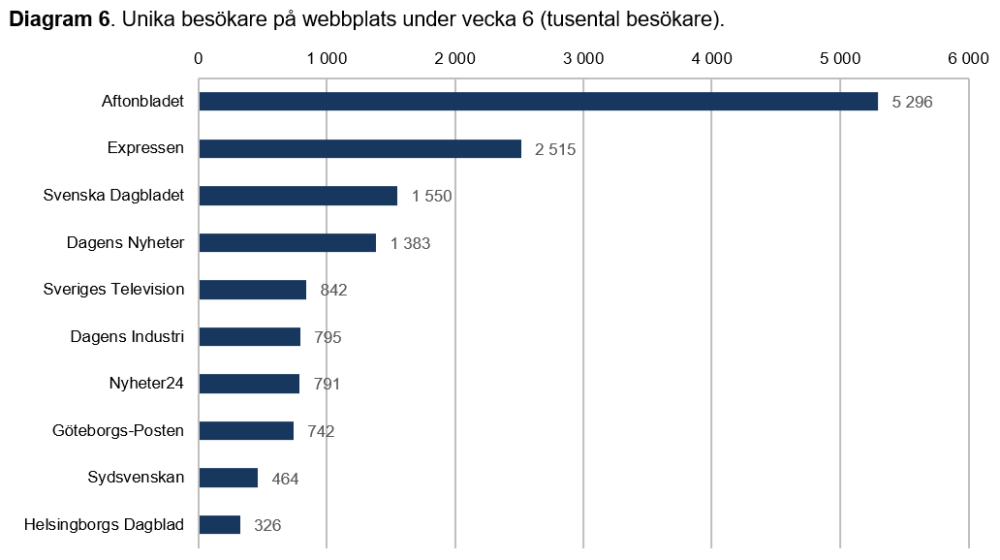
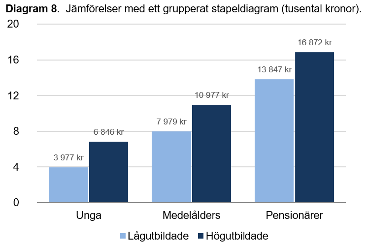
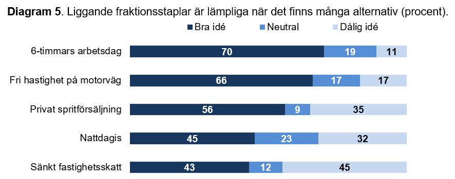

# Diagram {#dataviz}

Här hittar du:

- Tips för att skapa diagram
- Typer av diagram och hur du konstruerar dem
- Hjälp med att välja lämpligt diagram

## Grunderna i datavisualisering

Ibland brukar man prata om *explorativ dataanalys*. Det betyder att man inledningsvis utforskar datan för att se vad den innehåller. Explorativ dataanalys är med andra ord endast till för att forskaren ska kunna bilda sig en uppfattning om datan, ofta med hjälp av diagram och tabeller som.

Vanliga tabeller och diagram som används under explorativ dataanalys som är bra att känna till:

- [Frekvenstabell](https://en.wikipedia.org/wiki/Frequency_distribution)
- [Korstabell](https://en.wikipedia.org/wiki/Contingency_table)
- [Histogram](https://sv.wikipedia.org/wiki/Histogram)
- [Box plot](https://sv.wikipedia.org/wiki/L%C3%A5dagram) (ibland också Lådagram eller Whisker Plot)

Denna text handlar dock inte om explorativ dataanalys, utan om visualisering som du vill publicera eller visa upp för andra. Men första steget till att hitta denna data är dock en explorativ dataanalys.

Några tips när du utformar diagram och tabeller:

1. **Diagram och tabeller bör kunna läsas fristående från texten.** Tanken är att någon som skummar texten också kan ta till sig det viktiga bara genom att titta på diagrammet eller tabellen.

2. **Gå från det enkla till det komplicerade.** När man presenterar diagram och tabeller är det viktigt att inte ge allt för mycket information på en gång. Undvik att besvara *alla* frågeställningar med en enda tabell eller diagram. Börja i stället enkelt och presentera beskrivningar av datan (deskriptiv analys). Därefter kan du visa på intressanta samband (bivariat analys) för att därefter presentera mer komplicerade modeller (multivariat analys). Börja med andra ord med det enkla och gå successivt mot det mer komplicerade. Vad man ska välja att presentera? Du måste veta vad din forskningsfråga är, och därmed vad du bör välja bort. Därför underlättar det betydligt om man har ett genomtänkt syfte och åtminstone en idé om hur det färdiga resultatet kan se ut.

### Generella tips

Diagram är det vanligaste sättet att presentera mycket data. En bra tabell är en grundförutsättning för ett bra diagram.

Det finns dock några tips du bör tänka på när du skapar diagram.

**Innehåll**

- Försök inte trycka in allt för många saker i ett enda diagram. Behöver du visa många saker, gör många diagram. 
- Låt någon utomstående titta på ditt diagram. Förstår han eller hon? Om inte, gör om!

**Axlar**

- Lägg den oberoende variabeln på den horisontella axeln (X).
- Lägg den beroende variabeln på den vertikala axeln (Y).
- Låt axeln börja på 0 (exempelvis 0 till 100 procent), om du inte har goda skäl för något annat.

**Linjer**

- Använd olika typer av linjer (streckade, heldragna m.fl.) för att skilja dem åt.

**Perspektiv och färger**

- Undvik 3D-diagram.
- Använd hög kontrast.
- Följ ett färgschema, se exempelvis [Practical Rules for Using Color in Charts
](http://www.perceptualedge.com/articles/visual_business_intelligence/rules_for_using_color.pdf).
- Diagram bör kunna skrivas ut i svartvitt. Förlita dig därför inte enbart på olika färger för att skilja linjer åt.

**Många diagram**

Ska du visa många diagram jämte varandra? Tänk då på att:

- Använd samma skalstorlek (exempelvis 0-100 procent) på alla diagrams axlar. Om du har 0-20 på ett diagram och 0-70 på ett annat blir de svårare att jämföra.
- Gör ett snyggt diagram en gång. Kopiera och klistra sedan in det flera gånger för att spara tid. Använd [mallen för Excel](#mall-för-excel) som finns här.

## Pajdiagram

Pajdiagram är runda och ser ut som pajer, där varje del i pajen representerar en andel. Du bör undvika att använda pajdiagram av två skäl:

- Det är svårt att uppskatta den relativa storleken på respektive andel.
- Det går inte att jämföra två pajdiagram med varandra på ett enkelt sätt.

Om du ändå vill använda pajdiagram bör du tänka på att:

- Använd inte mer än ett fåtal kategorier. Annars blir det svårt att överblicka. Sikta på omkring 2-5 kategorier.
- Kategorierna presenteras från störst till minst. Om du exempelvis sorterar de fem största städerna så bör Stockholm vara först, följt av Göteborg och så vidare.
- Den största kategorin placeras med början klockan 12 och rör sig sedan medsols mot exempelvis klockan 4 (Stockholm). Därefter följer kategorierna i fallande ordning, från klockan 4 till klockan 6 (Göteborg), och så vidare.

## Linjediagram

Linjediagram är användbara när du ska visa trender eller tidsserier.

Lägg gärna etiketterna (i det här fallet "Förtroende för regeringen") i slutet av linjen. Det gör det lättare att se vad linjerna representerar, utan att man behöver hoppa fram och tillbaka med blicken mellan linjen och en förklaringsruta.

")

## Stapeldiagram

Stapeldiagram är användbara när du vill jämföra två eller fler kategorier. En frekvenstabell med kategoriska variabler kan lämpligen göras om till ett stapeldiagram.

Använd liggande stapeldiagram när du har många kategorier och man ska kunna läsa dem med enkelhet. Liggande stapeldiagram är också användbart när kategorinamnen (i det här fallet Aftonbladet, Expressen etc.) är långa och blir svårlästa på X-axeln.

Sortera listan på ett relevant sätt, exempelvis från högsta till lägsta värdet. Lägg värdena i slutet av staplarna så att dessa framgår tydligt.

## Grupperat stapeldiagram

Grupperade stapeldiagram är användbara om du behöver jämföra grupper med varandra. En korstabell med kategoriska variabler kan lämpligtvis göras om till ett grupperat stapeldiagram.

Tänk på att förenkla så att det inte blir för många staplar. Du kan exempelvis slå ihop kategorier. Lägg gärna värdet ovanför eller i stapeln.

Sortera gärna staplarna på ett logiskt sätt, som i det här fallet utifrån ökande ålder.

## Staplad fraktionsstapel

En staplad fraktionsstapel visar andelen (fraktionen) av helheten. En korstabell med kategoriska variabler som du vill jämföra kan lämpligtvis göras om till en staplad fraktionsstapel.

När du gör en fraktionsstapel behöver du inte göra om din data till procent, Excel gör det automatiskt.

En staplad fraktionsstapel fungerar bra för att visa Likert-skalor. De kan enkelt jämföras genom att man placerar flera staplar jämte varandra. Sifforna i respektive stapel uppgår till hundra procent.

.")

Fraktionsstapeln kan också placeras liggande om man har många kategorier:

## Mall för Excel

Du kan ladda ned en mall för Excel som du kan använda när du gör dina diagram.

Mallen innehåller i dagsläget:

- grupperat stapeldiagram
- liggande stapeldiagram för Likert-skalor
- linjediagram för tidsserier
	
**Ladda ned: [diagram-mall.xlsx](filer/diagram-mall.xlsx)**

## Välja diagram

Vilken typ av diagram bör man välja? Det beror på hur många variabler du vill visualisera.

Använd [Interactive Chart Chooser](https://depictdatastudio.com/charts/) och svara på ett par
frågor för att ta reda på vilken typ av diagram du bör välja.

### En variabel

| Typ av variabel | Diagram |
| ------------------------------- | ----------------------------------------------- |
| Kvalitativ variabel | Pajdiagram, stapeldiagram, dot plot |
| Kvantitativ variabel | Histogram, box plot, dot plot, jitter plot, density plot |

### Två variabler

| Typ av variabel | Diagram |
| ------------------------------- | ----------------------------------------------- |
| 2 kvalitativa variabler | Grupperat stapeldiagram, fraktionsstapel |
| 1 kvalitativ och 1 kvantitativ variabel | Stapeldiagram, linjediagram, box plot, violin plot |
| 2 kvantitativa variabler | Linjediagram, scatter plot, frequency heatmap |

I linjediagrammet läggs den oberoende variabeln (X) på den liggande axeln. Den beroende variabeln (Y) läggs på den stående axeln.

### Tre variabler

| Typ av variabel | Diagram |
| ------------------------------- | ----------------------------------------------- |
| 3 kvalitativa variabler | Stapeldiagram, korstabell |
| 2 kvalitativa och 1 kvantitativ variabel | Stapeldiagram, linjediagram |
| 1 kvalitativ och 2 kvantitativa variabler | Stapeldiagram, linjediagram |
| 3 kvantitativa variabler | Linjediagram |

I linjediagrammet läggs den oberoende variabeln (X) på den liggande axeln. Den beroende variabeln (Y) läggs på den stående axeln. Den tredje interaktionsvariabeln (Z) delas upp i två kategorier (exempelvis man/kvinna eller låg/hög utbildning) och varje kategori får en egen linje.

En fördel med linjediagram med tre variabler (jämfört med stapeldiagram) är att linjediagram ibland är enklare att tolka. Är linjerna parallella finns det ingen interaktion. Är avståndet litet är också additiviteten liten (det vill säga, variablerna ökar inte tillsammans). De fyra kombinationerna finns i tabellen nedan:

| Linjer parallella | Linjer avstånd | Interaktion? | Additivitet? | Tolkning |
| -------- | --------------- | --------------- | --------------- | --------------- | 
| Parallella | Kort avstånd | — | — | Ingen interaktion och låg additivitet | 
| Parallella | Långt avstånd | — | Ja | Ingen interaktion och hög additivitet | 
| Ej parallella | Kort avstånd | Ja | — | Interaktion och låg additivitet | 
| Ej parallella | Långt avstånd | Ja | Ja | Interaktion och hög additivitet | 

## Se även

- [DataViz project](http://datavizproject.com/) - katalog över olika typer av grafer och vilken typ av data som krävs för att skapa graferna.
- [Checklista för vetenskapliga undersökningar](#checklist) - kritiska frågor för att bedöma vetenskapliga undersökningar.

### Video

**[Introduction to data visualization](https://www.youtube.com/watch?v=XIgjTuDGXYY)**

An introduction to the practice of data visualization, with theory, examples, and good humor. Studio rerecording of a presentation at McGill University graduate students.

<iframe class="mediaplayer videoplayer" src="https://www.youtube.com/embed/XIgjTuDGXYY" frameborder="0" allowfullscreen></iframe>

**[Data Visualization Best Practices](https://www.youtube.com/watch?v=w1Ts0vT5Pf0)**

Learn how to get the most out of your business intelligence platform including how to choose the right chart type, and how to optimise your charts to make them easier to understand and more attractive.

<iframe class="mediaplayer videoplayer" src="https://www.youtube.com/embed/w1Ts0vT5Pf0" frameborder="0" allowfullscreen></iframe>

### Böcker

- Cairo, A. (2016). *The Truthful Art: Data, Charts, and Maps for Communication*. New Riders.
- Few, S. (2012). *Show Me the Numbers: Designing Tables and Graphs to Enlighten (2nd edition)*. Burlingame, Calif.: Analytics Press.
- Tufte, E. (2001). *The Visual Display of Quantitative Information (2nd edition)*. Cheshire, Conn: Graphics Pr.
- Wallgren, A., & Wallgren, B. (2008). *Diagram - statistikens bilder*. Stockholm: Norstedts juridik.