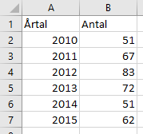

# (PART) Hantera data {-}

# Hantera data {#data-management}

Statisik, tabeller och diagram förutsätter data. Men sällan eller aldrig går traditionella metodböcker in på hur datan bör vara strukturerad för att man effektivt ska kunna hantera dem i datorprogram och kunna göra fortsatta anlyser.

Konvertering från ett format till ett annat är, kanske något oväntat, det viktigaste och ofta svåraste steget i processen.

## Dataformat

Det mest tidskrävande med datavisualisering är ofta att se till att datan är anpassad för det program man använder. När man förbereder data för Excel eller statistikprogram kan datan ibland behöva vara i rätt format.

Man brukar skilja mellan två dataformat: långt och brett.

### Tidy data

...

### Långt dataformat

### Brett dataformat

