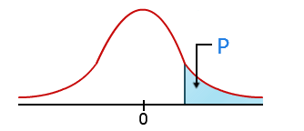

# Statistik {#stats}

Här hittar du:

- Deskriptiv och inferentiell statistik
- Hur man tolkar p-värden
- Videoguider på engelska om statistik

All statistik handlar om jämförelser. Tricket till att förstå statistik är därför att förstå vilka två saker man faktiskt jämför med varandra.

## Två typer av statistik

Man brukar skilja på två typer av statistik, deskriptiv och inferentiell statistik. 

**Deskriptiv statistik** är ett annat namn för *beskrivande* statistik. Det är inte svårare än att man beskriver data på olika sätt. I en enkätundersökning kan det handla om hur många som svarat, vilken medelålder respondenterna har, var de flesta bor, och så vidare. Man uttalar sig alltså endast om datamängden och inte något utanför datamängden. Det finns heller ingen större osäkerhet i statistiken. Om medelåldern är 50 år i datamängden så gäller detta endast de som har svarat, inga andra.

**Inferentiell statistik** går ett steg längre och säger något utöver den data man faktiskt har undersökt. Denna typ av statistik är *alltid* behäftad men viss osäkerhet. Det går till så att man tar ett stickprov från en population, undersöker stickprovet, och drar sedan slutsatser om populationen baserat på detta stickprov. Då beskriver man stickprovet (precis som vid den deskriptiva statistiken), men man går ett steg längre och säger dessutom något *utöver* de personer man undersöker. Det innebär att slutsatsen inte bara gäller datan man analyserar, utan faksitk också hela populationen. Om medelåldern är 50 år i datamängden så gäller detta Sveriges befolkning. Men för att kunna dra sådana slutsatser krävs det att man bland annat använder ett slumpmässigt urval. Eftersom man inte har undersökt hela befolkningen finns det dock alltid en viss osäkerhet, och denna osäkerhet kan kvantifieras med hjälp av felmarginal, p-värden och konfidensintervall.

All inferentiell statistik kan egentligen kokas ned till en enkel formel: `Data = modell + fel`.

## P-värden {#p-values}

P-värdet är förmodligen det absolut krångliaste att förstå. Det beror på att det är ett krångligt koncept, och feltolkningar är dessutom vanliga.

Här gör jag några pedagogiska försök att skapa en intuitv förståelse för p-värdet. P-värden används vid inferentiell statistik. Syftet med p-värdet är att skilja signalen från bruset. Signalen är exempelvis ett samband, och bruset är slumpmässigheter som alltid uppstår vid slumpmässiga urval. P-värdet ger därför en indikation på hur väl man lyckats skilja en signal från bruset, och i statistikprogrammet dyker p-värdet ofta upp tillsammans med ett sambandsmått. Då ser man hur pass väl det här sambandsmåttet kunde skiljas från bruset (om sambandsmåttet skiljer sig från ett nollsamband).

Definitionen av p-värdet är följande: *sannolikheten att få ett resultat som är så extremt (eller mer extremt), givet att nollhypotesen är sann.*

P-värden kommer från ett statistiskt test som man genomför på en datamängd. P-värdet går från 0 till 1. Ju närmare 0 det är, desto mindre sannolikhet att du har fått resultatet ifråga, givet att nollhypotesen är sann. Ju närmare 1 det är, desto större sannolikhet att du har fått resultatet ifråga, givet att nollhypotesen är sann.

### Hur man tolkar p-värdet

- Ett **lågt p-värde** (exempelvis p = 0,001) innebär att det är osannolikt att få det resultatet du fått, givet att nollhypotesen är sann. Det går därmed säga att det observerade sambandet skiljer sig från ett nollsamband. Annorlunda uttryckt: det går skilja signalen från bruset, och det innebär att ett samband kunde hittas.
- Ett **högt p-värde** (exempelvis p = 0,583) innebär att det är sannolikt att få det resultatet du fått, givet att nollhypotesen är sann. Det går därmed inte säga att det observerade sambandet skiljer sig från ett nollsamband. Annorlunda uttryckt: det går inte skilja signalen från bruset, och det innebär att något samband inte kunde hittas.

Ett p-värde på 0,012 betyder exempelvis att det är 1,2 % sannolikhet att få det resultat du fått, eller mer extremt, givet att nollhypotesen är sann. Det betyder, i praktiken, att det är väldigt osannolikt att sambandet kunde uppstå om det faktiskt inte fanns i populationen.

När du tittat på p-värdet tittar du därefter på sambandsmåttet för att se hur stort sambandet är.

### Exempel: placera bollar i korgar

Vi kan ta ett exempel på hur p-värdet fungerarar.

1. Du har 100 stycken bollar som ska placeras i två korgar.
2. Om bollarna placeras helt slumpmässigt i korgarna kommer det att vara ungefär 50 bollar i ena korgen och 50 i den andra (50/50). Då säger vi att det inte finns något samband mellan korgarna och bollarna. Detta är nollhypotesen.
3. Låt säga att vi i stället lägger 30 bollar i ena korgen och 70 i den andra korgen. Detta är den alternativa hypotesen.
4. Vi kan nu jämföra fördelningen 50/50 (nollhypotesen) med fördelningen 30/70 (alternativa hypotesen).
5. Vi kan uttrycka sannolikheten att vi fått detta resultat (30/70) eller mer extremt, givet att bollarna är fördelade slumpmässigt 50/50. Denna sannolikhet är p-värdet.
6. När bollarna placeras 30/70 så är det resultatet så pass extremt, givet fördelningen 50/50, att p-värdet blir väldigt litet (se nedan). Vi förkastar då nollhypotesen (50/50) och accepterar den alternativa hypotesen.
6. Men om bollarna hade placeras 51/49 så är resultatet inte alls extremt, givet fördelningen 50/50, och p-värdet blir då väldigt stort (se nedan). Vi kan då inte förkasta nollhypotesen (50/50).

Det enda p-värdet gör är alltså att se om bollarna har placerats slumpmässigt i korgarna, eller inte. I vetenskap hjälper p-värdet att se om ett samband kan ha uppstått slumpmässigt eller inte.

Här är några exempel på vad p-värdet blir när man flyttar runt bollarna i korgarna:[^Uträknat med exakt binomialt test, exempelvis `binom.test(50, 100, 0.5)`.]

- Om bollarna är fördelade 50/50 blir p = 1. Tolkning: Det observerade resultatet är väldigt sannolikt givet slumpen. Det observerade resultatet (50/50) är inte extremt i förhållande till slumpen (50/50) eftersom de är identiska.
- Om bollarna är fördelade 51/49 blir p = 0,920. Tolkning: Det är väldigt sannolikt givet slumpen.
- Om bollarna är fördelade 55/45 blir p = 0,368. Tolkning: Det är fortfarande sannolikt givet slumpen (även om det är något mindre sannolikt).
- Om bollarna är fördelade 30/70 blir p = 0,0000785. Tolkning: Det är väldigt osannolikt givet slumpen.
- Om bollarna är fördelade 10/90 blir p = 0,00000000000000022. Tolkning: Det är extremt osannolikt givet slumpen.

### Vad som påverkar p-värdet

Det är sampelstorleken och effektstorleken som påverkar p-värdet. Det innebär att man får mindre p-värden om man har många analysenheter. I en [surveyundersökning](#surveys) är det därför lättare att få lägre p-värden om man frågar fler personer. Det är också lättare att få låga p-värden ju större sambandet är.

I exemplet ovan med bollarna innebär det att fördelningen av bollarna påverkar p-värdet.

### Vilka missförstånd om p-värden

Här är några vanliga missförstånd kring p-värden:

- P-värdet visar *inte* sannolikheten att nollhypotesen är sann. (Utgångspunkten är alltid att nollhypoten är sann.)
- P-värdet visar *inte* vad som är relevant, viktigt eller vetenskapligt intressant. (P-värdet har enbart med datan att göra.)
- P-värdet visar *inte* sannolikheten att resultatet beror på slumpen. (Slumpen är utgångspunkten, se första punkten.)
- P-värdet visar *inte* sannolikheten att få samma resultat om gör analysen en gång till.
- P-värdet visar *inte* storleken på sambandet. (Eftersom sampelstorleken skiljer sig åt kommer p-värdet skilja sig åt.)

P-värdet bör inte betraktas svartvit. Ett p-värde på 0,049 är inte bättre än ett p-värde på 0,051. Det är snarare en skala, där lägre p-värde kan göra oss mer säkra på att ett samband finns.

Bli inte vemodig om du har svårt att förstå p-värden. Till och med forskare brottas med frågan: [Not Even Scientists Can Easily Explain P-values](http://fivethirtyeight.com/features/not-even-scientists-can-easily-explain-p-values/). Det är ett krångligt koncept som är lätt att få om bakfoten. P-värden har kritiserats i nästan hundra år, kanske starkast av psykologen Paul Meehl som sa att det är "one of the worst things that ever happened in the history of psychology" (Meehl, 1978, s. 817).

### Statistisk signifikans

**Statistisk signifikans** är när p-värden är under en godtycklig gräns. 

Av tradition brukar man säga att p-värden under 0,05 är *statistiskt signifikanta*, medan p-värden som är 0,05 eller över inte är statistiskt signifikanta. Därför ser man ofta `p < 0,05` i vetenskapliga texter.

Teoretiskt säger gränsen på 0,05 att det är mindre än 5 % sannolikhet att resultatet har uppstått, givet nollhypotesen.

Gränsen 0,05 är fullständigt godtycklig och används av historiska skäl. Gränsen brukar kallas signifikansnivå, och den bestämmer man själv *innan* man gör analysen.

**Nollhypotesen** är antagandet att det *inte* finns något samband mellan två variabler. Nollhypotesen skrivs ofta H0.

Den **alternativa hypotesen** är antagandet att det *finns* en skillnad mellan två variabler. Den alternativa hypotesen skrivs ofta H1. 

Om du signifikanstestar ett sambandsmått är nollhypotesen "det finns inget samband". Med andra ord att sambandsmåttet är 0 (såsom Pearsons r = 0.0). Ju längre ifrån 0 sambandet är, desto lägre kommer p-värdet att bli. Statistiska tester jämför med andra ord hur extremt resultatet är i förhållande till 0.

### P-värdet i SPSS

Titta i kolumnen *Approximate Significance* (*Approx. Sig.*) eller bara *Sig*.

Ibland står det att p-värdet är `0,000`. Men det beror på avrundning. Skriv då att `p < 0,001`.

### Rapportera p-värden

P-värden rapporteras alltid tillsammans med ett statistikt test, till exempel sambandsmått. Skriv därför p-värdet efter sambandsmåttet. Rapportera alltid p-värdet med 3 decimaler. Skriv `p < 0,001` om du får fram tre nollor.

Exempel 1:

> Det fanns en medelstor positiv korrelation mellan tidningsläsning och politisk kunskap (` r = 0,31; p = 0,002`).

Här syftar `r` på Pearsons r. Notera att texten i princip skrivs i följande format: `Det fanns en [liten/medelstor/stor] korrelation mellan [X] och [Y] (r = 0,000; p = 0,000)`.

Du kan inte skriva att tidningsläsning *påverkar* politisk kunskap eftersom vi inte vet den kausala riktningen (om du inte genomför experiment eller dylikt).

Exempel 2:

> Det fanns en medelstor korrelation mellan tidningsläsning och politisk kunskap (`Cramérs V = 0,31; p = 0,002`).

Notera att Cramérs V går från 0 till 1 och därmed inte har någon riktning. Det finns alltså ingen positiv eller negativ korrelation när man har Cramérs V.

## Lär dig mer

### Video {#signifikans-sundell}

Anders Sundell (Statsvetenskapliga institutionen) förklarar signifikans och p-värden i denna video.

<iframe width="560" height="315" src="https://www.youtube.com/embed/8qiJLwxifY4" frameborder="0" allowfullscreen></iframe>

Fler videor om p-värden:

- [What is a p-value? (6 min)](https://www.youtube.com/watch?v=HTZ8YKgD0MI)
- [Hypothesis testing and p-values - Khan Academy (12 min)](https://www.youtube.com/watch?v=-FtlH4svqx4)
- [Probability and Statistics - Khan Academy](https://www.youtube.com/watch?list=PL1328115D3D8A2566&v=uhxtUt_-GyM)

Khan Academy har en mängd YouTube-videor med grundläggande statistik till mer avancerad statistik. Titta på spellistan nedan med grundläggande deskriptiv statistik:

<iframe class="videoplayer" width="560" height="315" src="https://www.youtube.com/embed/uhxtUt_-GyM?list=PL1328115D3D8A2566" frameborder="0" allowfullscreen></iframe>

Se också [Videos for teaching and learning statistics](https://learnandteachstatistics.wordpress.com/2018/01/09/videos-for-teaching-and-learning-statistics/).

### Böcker

- Djurfeldt, G., Larsson, R. & Stjärnhagen, O. (2010). *Statistisk verktygslåda 1: samhällsvetenskaplig orsaksanalys med kvantitativa metoder (2. uppl.)*. Lund: Studentlitteratur.
- Field, A. P. (2013). *Discovering statistics using IBM SPSS statistics: and sex and drugs and rock “n” roll (4th edition)*. Los Angeles: Sage.
- Miles, J. & Shevlin, M. (2001). *Applying regression & correlation: a guide for students and researchers*. London: SAGE.
- Yu, C.H. (2006). *Philosophical foundations of quantitative research methodology*. Lanham, Md.: University Press of America.

## Referenser

- Meehl, P.E. (1978). Theoretical risks and tabular asterisks: Sir Karl, Sir Ronald, and the slow progress of soft psychology. *Journal of Consulting and Clinical Psychology 46*, 806–834.